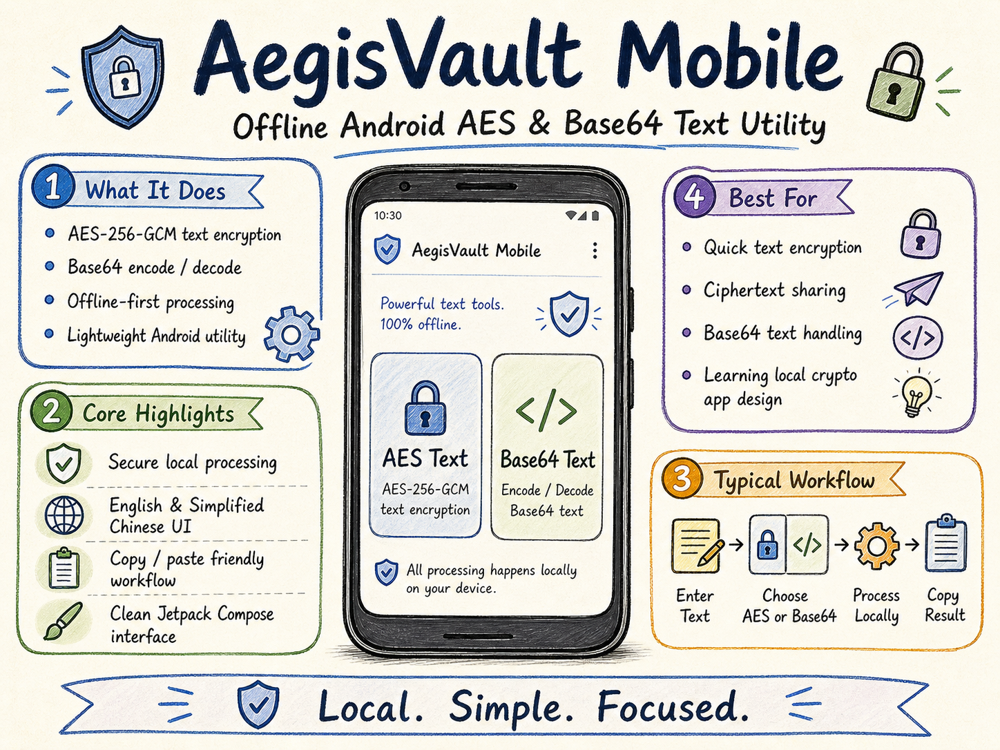

<div align="center">

# 🛡️ AegisVault Mobile

### A cleaner offline Android utility for text encryption and Base64 processing

**AES-256-GCM text encryption / Base64 encode & decode / Bilingual UI / Offline-first**

[简体中文](./README.md) · [Download APK](https://github.com/Qrzzzz/AegisVaultMobile/releases/latest) · [Changelog](./CHANGELOG.md) · [Security](./SECURITY.md)


</div>

---

## ✨ Overview

**AegisVault Mobile** is a focused, lightweight, offline-first Android text utility.

It does two things clearly:

1. Encrypt and decrypt text with **AES-256-GCM**.
2. Encode and decode text with **Base64**.

It does not rely on accounts, cloud sync, or server-side processing. The workflow stays local: enter text, enter a passphrase, generate output, and copy the result. It is suitable for temporary text encryption, ciphertext sharing, Base64 text processing, and learning how a local Android encryption utility can be implemented.

> ⚠️ Base64 is encoding, not encryption. It only changes representation and does not provide secrecy.

---

## 🤖 AI Assistance Notice

This project was developed, organized, documented, and release-optimized with assistance from Codex (ChatGPT 5.5) and Gemini 3.1 Pro.

---

<p align="center">
  
</p>

## 🚀 Features

### 🔐 AES Text Encryption

- **AES-256-GCM** text encryption and authentication
- Password-based key derivation with **scrypt**
- Random salt and random nonce for every encryption
- Modern `AGV1.` encrypted text format
- Modern token decryption
- Legacy text compatibility
- Warning for high-risk legacy `AK#` compatibility mode

### 🔤 Base64 Text Utility

- Base64 text encoding
- Base64 text decoding
- Clear distinction between encoding and encryption
- No password required

### 📱 Android Experience

- Jetpack Compose UI
- English and Simplified Chinese interface
- In-app language switching
- System light/dark appearance support
- Clipboard paste helper
- Result copy helper
- Clear-all action
- Operation status feedback

### 📴 Offline-first

- No server dependency
- No account system
- No upload of user input
- Android backup disabled

---

## 📦 Download

Download the APK from GitHub Releases:

👉 [Download the latest release](https://github.com/Qrzzzz/AegisVaultMobile/releases/latest)

Current version:

```text
AegisVault Mobile v1.0.1
```

> The current APK is debug-signed and intended for testing and demonstration. For production distribution, build a release APK or AAB with a private signing key.

---

## 🧩 Usage

### AES Encryption

1. Select `AES Text`.
2. Enter the text to encrypt.
3. Enter an AES key / passphrase.
4. Tap `Encrypt`.
5. Copy the generated `AGV1.` token.

### AES Decryption

1. Select `AES Text`.
2. Paste the `AGV1.` token.
3. Enter the same passphrase used for encryption.
4. Tap `Decrypt`.
5. Read and copy the plaintext result.

### Base64 Encode / Decode

1. Select `Base64 Text`.
2. Enter text or Base64 content.
3. Tap `Encode` or `Decode`.
4. Copy the result.

---

## 🔐 Security Model

Modern AegisVault text tokens start with `AGV1.`. The basic process is:

```text
User passphrase
  ↓
scrypt + random salt
  ↓
AES-256 key
  ↓
AES-256-GCM + random nonce
  ↓
AGV1 token
```

The encrypted payload contains:

- version
- content kind
- algorithm metadata
- KDF parameters
- salt
- nonce
- ciphertext

### Important Notes

- Passwords are not intentionally stored by the app.
- If the passphrase is lost, encrypted text usually cannot be recovered.
- Clipboard contents may still be visible to the operating system or privileged software.
- Debug APKs are not suitable for high-risk security scenarios.
- This project is not a replacement for a professional password manager, hardware security module, or enterprise key-management system.

---

## 🏗️ Tech Stack

| Area | Technology |
|---|---|
| Language | Kotlin |
| UI | Jetpack Compose / Material 3 |
| Encryption | AES-256-GCM |
| KDF | scrypt |
| Base64 | Java Base64 |
| Minimum Android | Android 8.0 / API 26 |
| Build System | Gradle Kotlin DSL |
| License | MIT |

---

## 🛠️ Development and Build

### Requirements

- Android Studio or Android SDK command-line tools
- JDK 17
- Gradle Wrapper
- Android Gradle Plugin 8.5.2
- Kotlin Android Plugin 1.9.24

### Clone

```bash
git clone https://github.com/Qrzzzz/AegisVaultMobile.git
cd AegisVaultMobile
```

### Run Tests

Windows PowerShell:

```powershell
.\gradlew.bat testDebugUnitTest
```

macOS / Linux:

```bash
./gradlew testDebugUnitTest
```

### Build Debug APK

Windows PowerShell:

```powershell
.\gradlew.bat assembleDebug
```

macOS / Linux:

```bash
./gradlew assembleDebug
```

Generated APK:

```text
app/build/outputs/apk/debug/app-debug.apk
```

### Create Named Local APK Package

Windows PowerShell:

```powershell
.\scripts\package-apk.ps1
```

Output:

```text
dist/AegisVaultMobile-v1.0.1-debug.apk
```

---

## 📁 Project Structure

```text
AegisVaultMobile/
├── .github/
│   └── workflows/
│       └── android.yml
├── app/
│   ├── build.gradle.kts
│   └── src/
│       ├── main/
│       │   ├── AndroidManifest.xml
│       │   ├── java/com/aegisvault/mobile/
│       │   │   ├── MainActivity.kt
│       │   │   ├── core/
│       │   │   │   └── AegisVaultEngine.kt
│       │   │   ├── data/
│       │   │   │   └── AppPreferences.kt
│       │   │   └── ui/theme/
│       │   └── res/
│       │       ├── values/
│       │       ├── values-zh-rCN/
│       │       └── xml/
│       └── test/
│           └── java/com/aegisvault/mobile/core/
├── scripts/
│   └── package-apk.ps1
├── CHANGELOG.md
├── LICENSE
├── README.md
├── README_EN.md
└── SECURITY.md
```

---

## 🧪 Current Version

### v1.0.1

Initial GitHub release.

Main contents:

- AES-256-GCM text encryption and decryption
- Base64 encode and decode
- English and Simplified Chinese UI
- Offline-first Android app
- Debug APK for testing

---

## ⚠️ Disclaimer

AegisVault Mobile is a lightweight local text utility. Although it uses modern cryptographic primitives, real-world security still depends on passphrase strength, device security, clipboard exposure, and APK signing.

Do not use debug builds for production, commercial, or high-risk security scenarios.

---

## 📄 License

This project is open-sourced under the [MIT License](./LICENSE).

## Security note
AegisVault minimizes persistence of sensitive text (input/password/result are kept in memory during current activity lifecycle), but cannot guarantee absolute security against OS services, keyboards/IMEs, clipboard exposure, screenshots, rooted devices, or malware.
